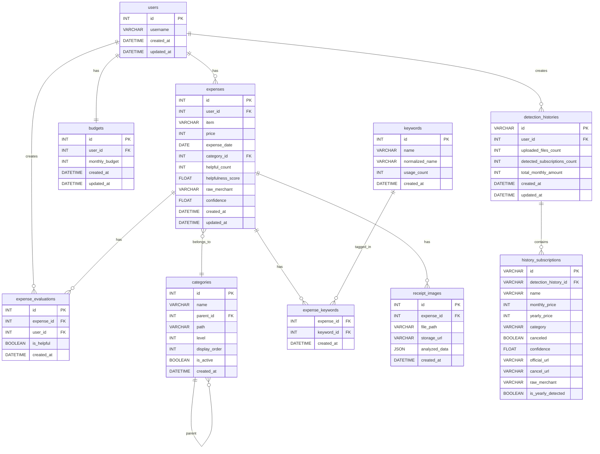

# テーブル定義

本ドキュメントは、プロジェクトで使用するデータベーステーブルの定義をまとめたもの。**正として、このドキュメントを更新すること**。基本要件定義書からは参照リンクのみ。

---

## ER図

GitHub や Mermaid 対応ビューアで表示されます。

---

## テーブル設計

### users テーブル
| カラム名 | 型 | 制約 | 説明 |
|---------|-----|------|------|
| id | INT | PRIMARY KEY, AUTO_INCREMENT | ユーザーID |
| username | VARCHAR(255) | UNIQUE, NOT NULL | ユーザー名 |
| created_at | DATETIME | NOT NULL, DEFAULT CURRENT_TIMESTAMP | 作成日時 |
| updated_at | DATETIME | NOT NULL, DEFAULT CURRENT_TIMESTAMP ON UPDATE CURRENT_TIMESTAMP | 更新日時 |

### expenses テーブル
| カラム名 | 型 | 制約 | 説明 |
|---------|-----|------|------|
| id | INT | PRIMARY KEY, AUTO_INCREMENT | 支出ID |
| user_id | INT | FOREIGN KEY (users.id), NOT NULL | ユーザーID |
| item | VARCHAR(255) | NOT NULL | アイテム名 |
| price | INT | NOT NULL | 金額 |
| expense_date | DATE | NOT NULL | 支出日（デフォルト: 現在日） |
| created_at | DATETIME | NOT NULL, DEFAULT CURRENT_TIMESTAMP | 作成日時 |
| updated_at | DATETIME | NOT NULL, DEFAULT CURRENT_TIMESTAMP ON UPDATE CURRENT_TIMESTAMP | 更新日時 |

### budgets テーブル
| カラム名 | 型 | 制約 | 説明 |
|---------|-----|------|------|
| id | INT | PRIMARY KEY, AUTO_INCREMENT | 予算ID |
| user_id | INT | FOREIGN KEY (users.id), UNIQUE, NOT NULL | ユーザーID |
| monthly_budget | INT | NOT NULL | 月次予算額 |
| created_at | DATETIME | NOT NULL, DEFAULT CURRENT_TIMESTAMP | 作成日時 |
| updated_at | DATETIME | NOT NULL, DEFAULT CURRENT_TIMESTAMP ON UPDATE CURRENT_TIMESTAMP | 更新日時 |

### expense_evaluations テーブル（11期機能統合）
| カラム名 | 型 | 制約 | 説明 |
|---------|-----|------|------|
| id | INT | PRIMARY KEY, AUTO_INCREMENT | 評価ID |
| expense_id | INT | FOREIGN KEY (expenses.id), NOT NULL | 支出ID |
| user_id | INT | FOREIGN KEY (users.id), NOT NULL | ユーザーID |
| is_helpful | BOOLEAN | NOT NULL | 役立ったか（true/false） |
| created_at | DATETIME | NOT NULL, DEFAULT CURRENT_TIMESTAMP | 作成日時 |
| **UNIQUE制約**: (expense_id, user_id) | | | 1ユーザー1支出につき1評価 |

### categories テーブル（11期機能統合）
| カラム名 | 型 | 制約 | 説明 |
|---------|-----|------|------|
| id | INT | PRIMARY KEY, AUTO_INCREMENT | カテゴリID |
| name | VARCHAR(255) | NOT NULL | カテゴリ名 |
| parent_id | INT | FOREIGN KEY (categories.id), NULL | 親カテゴリID（階層構造用） |
| path | VARCHAR(500) | NULL | 階層パス（例: "1/5/23"） |
| level | INT | DEFAULT 0 | 階層レベル |
| display_order | INT | DEFAULT 0 | 表示順序 |
| is_active | BOOLEAN | DEFAULT TRUE | 有効フラグ |
| created_at | DATETIME | NOT NULL, DEFAULT CURRENT_TIMESTAMP | 作成日時 |

### keywords テーブル（11期機能統合）
| カラム名 | 型 | 制約 | 説明 |
|---------|-----|------|------|
| id | INT | PRIMARY KEY, AUTO_INCREMENT | キーワードID |
| name | VARCHAR(255) | NOT NULL | キーワード名 |
| normalized_name | VARCHAR(255) | NOT NULL, INDEX | 正規化済みキーワード名 |
| usage_count | INT | DEFAULT 1 | 使用回数 |
| created_at | DATETIME | NOT NULL, DEFAULT CURRENT_TIMESTAMP | 作成日時 |

### expense_keywords テーブル（11期機能統合）
| カラム名 | 型 | 制約 | 説明 |
|---------|-----|------|------|
| expense_id | INT | FOREIGN KEY (expenses.id), PRIMARY KEY | 支出ID |
| keyword_id | INT | FOREIGN KEY (keywords.id), PRIMARY KEY | キーワードID |
| created_at | DATETIME | NOT NULL, DEFAULT CURRENT_TIMESTAMP | 作成日時 |

### receipt_images テーブル（11期機能統合）
| カラム名 | 型 | 制約 | 説明 |
|---------|-----|------|------|
| id | INT | PRIMARY KEY, AUTO_INCREMENT | 画像ID |
| expense_id | INT | FOREIGN KEY (expenses.id), NULL | 支出ID（紐付け後） |
| file_path | VARCHAR(500) | NOT NULL | ファイルパス |
| storage_url | VARCHAR(500) | NULL | ストレージURL（Azure Storage等） |
| analyzed_data | JSON | NULL | AI解析結果（JSON形式） |
| created_at | DATETIME | NOT NULL, DEFAULT CURRENT_TIMESTAMP | 作成日時 |

### detection_histories テーブル（11期機能統合）
| カラム名 | 型 | 制約 | 説明 |
|---------|-----|------|------|
| id | VARCHAR(36) | PRIMARY KEY | UUID |
| user_id | INT | FOREIGN KEY (users.id), NOT NULL, INDEX | ユーザーID |
| uploaded_files_count | INT | NOT NULL | アップロードファイル数 |
| detected_subscriptions_count | INT | DEFAULT 0 | 検出されたサブスク数 |
| total_monthly_amount | INT | DEFAULT 0 | 月額合計金額 |
| created_at | DATETIME | NOT NULL, DEFAULT CURRENT_TIMESTAMP | 作成日時 |
| updated_at | DATETIME | NOT NULL, DEFAULT CURRENT_TIMESTAMP ON UPDATE CURRENT_TIMESTAMP | 更新日時 |

### history_subscriptions テーブル（11期機能統合）
| カラム名 | 型 | 制約 | 説明 |
|---------|-----|------|------|
| id | VARCHAR(36) | PRIMARY KEY | UUID |
| detection_history_id | VARCHAR(36) | FOREIGN KEY (detection_histories.id), NOT NULL | 検出履歴ID |
| name | VARCHAR(255) | NOT NULL | サービス名 |
| monthly_price | INT | NULL | 月額価格 |
| yearly_price | INT | NULL | 年額価格 |
| category | VARCHAR(100) | NULL | カテゴリ |
| canceled | BOOLEAN | DEFAULT FALSE | 解約フラグ |
| confidence | FLOAT | NULL | 確信度（0.0-1.0） |
| official_url | VARCHAR(500) | NULL | 公式URL |
| cancel_url | VARCHAR(500) | NULL | 解約URL |
| raw_merchant | VARCHAR(500) | NULL | 明細表記（例: "GOOGLE*YOUTUBE"） |
| is_yearly_detected | BOOLEAN | DEFAULT FALSE | 年額検出フラグ |

---

## expenses テーブルの拡張（11期機能統合）

既存の`expenses`テーブルに以下のカラムを追加：

| カラム名 | 型 | 制約 | 説明 |
|---------|-----|------|------|
| category_id | INT | FOREIGN KEY (categories.id), NULL | カテゴリID |
| helpful_count | INT | DEFAULT 0 | 役立った評価数 |
| helpfulness_score | FLOAT | DEFAULT 0.0 | 役立ちスコア（0.0-1.0） |
| raw_merchant | VARCHAR(500) | NULL | 明細表記（CSV解析時） |
| confidence | FLOAT | NULL | 確信度（AI解析時） |

---

## リレーションシップ

- `expenses.user_id` → `users.id` (多対1)
- `budgets.user_id` → `users.id` (1対1)
- `expense_evaluations.expense_id` → `expenses.id` (多対1)
- `expense_evaluations.user_id` → `users.id` (多対1)
- `expenses.category_id` → `categories.id` (多対1)
- `categories.parent_id` → `categories.id` (自己参照)
- `expense_keywords.expense_id` → `expenses.id` (多対多)
- `expense_keywords.keyword_id` → `keywords.id` (多対多)
- `receipt_images.expense_id` → `expenses.id` (多対1)
- `detection_histories.user_id` → `users.id` (多対1)
- `history_subscriptions.detection_history_id` → `detection_histories.id` (多対1)

---

## 開発方針（データベース）

- **テーブルは Sprint 0 で定義・作成する**
- 前回開発では途中からのマイグレーションが負荷となり、チーム全体でスキーマを揃えるのが難しかった経験がある
- そのため、必要なテーブル定義を Sprint 0 で確定し、Sprint 1 開始時点でテーブルが存在している状態にする
- Sprint 1 以降は原則として新規テーブル追加のみ（既存テーブルの変更は最小限に抑える）

---

*本ドキュメントは基本要件定義書の「3. データモデル」を切り出したもの。テーブル定義の更新は本ドキュメントのみを更新し、基本要件定義書からは参照リンクのみを維持すること。*
